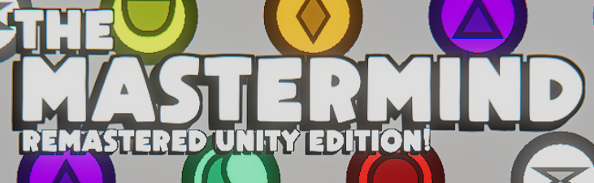
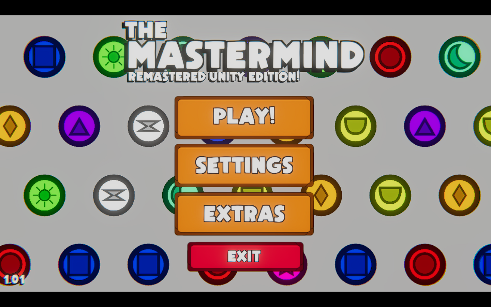
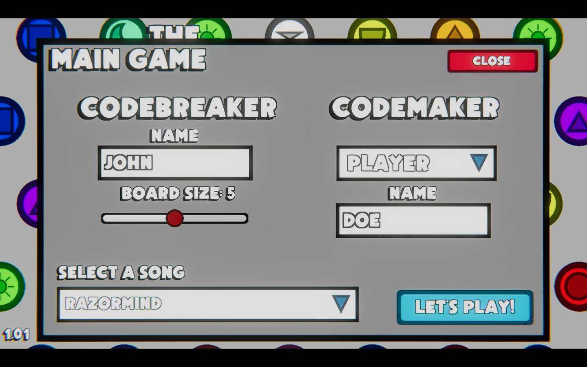
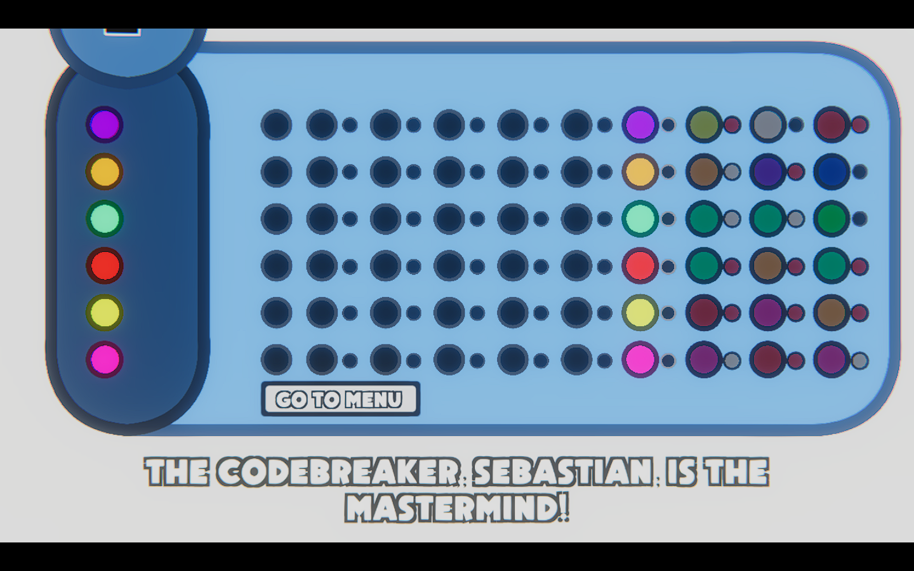

# The classic 1970 code-breaking board game has been resurrected!

# Mastermind | Unity Remake
---
## The Story
Mastermind is a game created in 1970 by Mordecai Meirowitz, it's a game about luck, intuition, intelligence and psicology. Two players, one is the **Codemaker**, he creates a code that hopefully can't be cracked and also provies clues to the **Codebreaker**, this one is the one trying to break the code by any means necessary, even tho only having 10 turns to crack it.

---
## The Remake
This is a digital remake made in the Unity engine with extra added features! You can play against other Player or against the CPU.

---
## The Features
The original game has 5 colors and 4 possible combinations, this remake has **9 colors**, Red, Blue, Yellow, White, Orange, Green, Greenish Blue, Pink and Purple and the possibility of having 4, 5 and 6 possible combinations. As one of the main mechanics of the game are **Colors** a **Daltonic Support** option has been added, it just adds little icons in the colored pegs so that they can be easily recognized. Another new feature is the **Stress System**, this system is made to stress the **Codebreaker** into decoding faster, this system has 4 phases **Decode**, **Hurry Up**, **Last Wish** and **Mastermind**, the **Decode** phase plays in the first 5 turns, the **Hurry Up** phase plays between the fifth and the nineth turn, **Last Wish** plays on the last attempt and **Mastermind** plays when the turns are over and the winner is decided.

---
## Screenshots

---
## Open Source!
This is an **Open Source** project which means that you can download this code and execute it on the Unity Engine. This project was compiled with Unity 2020.3.17f1

---
## Credits
Mastermind Unity Remake - by Sebastian Toro

Used - Unity Engine 2020.3.17f1 and Visual Studio Code

---
### Soundtrack
- [Gun Metal Grey 2015](https://www.youtube.com/watch?v=UytcoWrYZso)
- [Home Invasion 2016](https://www.youtube.com/watch?v=y9ANrEqpjbg&t=204s)
- [I Will Give You My All 2017](https://www.youtube.com/watch?v=aOH3yMslA74)
- [Code Silver 2018](https://www.youtube.com/watch?v=2Q5o7yHzNUA)
- [Pimped Out Getaway](https://www.youtube.com/watch?v=PwoWnVWHqPQ)
- [Ho Ho Ho](https://www.youtube.com/watch?v=FmBxsPhfo7c)
- [Razormind](https://www.youtube.com/watch?v=_Fl_LJBixfg)

**By Simon Viklund**

- [8-Bits Are Scary](https://www.youtube.com/watch?v=IVmLeRuqgHw&t=19s)

**By Carl Noren**

---
[Sebastian Toro](github.com/Seb1776)